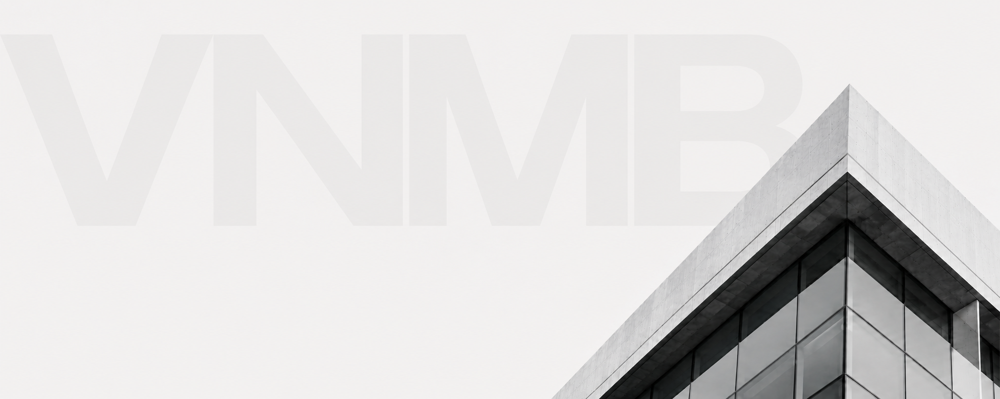

# VNMB Tecnologia

### Desenvolvimento de plataformas digitais e ecossistemas para as verticais de negócio VNMB.

---

## Quem Somos

A divisão de Tecnologia da VNMB é responsável pelo desenvolvimento e sustentação de sistemas, softwares e plataformas de alta performance. Nosso objetivo é centralizar e otimizar processos operacionais essenciais, garantindo eficiência, governança e escalabilidade.

Nossos produtos atuam diretamente em duas grandes frentes:
*   **Backoffice e Core Financeiro:** Soluções corporativas para as áreas de Suprimentos / Compras e Financeiro, automatizando fluxos de ponta a ponta.
*   **Plataformas de Holding:** Desenvolvimento tecnológico integrado para as empresas do grupo e investidas.

---

## Verticais de Negócio Atendidas

Nossa engenharia atende a um ecossistema diversificado de empresas, traduzindo necessidades complexas de negócio em código robusto e escalável:

| Empresa / Iniciativa | Setor de Atuação | Foco Tecnológico / Integração |
| :--- | :--- | :--- |
| **VB Agro** | Agronegócio | Plataformas de supply chain, logística e insumos agrícolas |
| **Igreja Pura Fé** | Terceiro Setor | Sistemas de gestão corporativa e plataformas de arrecadação |
| **Lorena** | Varejo e Serviços | Plataformas de e-commerce, CRM e inteligência de mercado |
| **JAB** | Investimentos e Gestão | Painéis financeiros, relatórios analíticos e inteligência de dados |
| **BRC TOKEN** | Web3 e Ativos Digitais | Contratos inteligentes, tokenização de ativos e blockchain |
| **Imóveis** | Mercado Imobiliário | Plataformas de gestão de portfólio, locação e ativos físicos |

---

## Ecossistema Técnico

Buscamos manter uma stack moderna, priorizando arquiteturas orientadas a microsserviços, segurança da informação e alta disponibilidade:

*   **Frontend:** React.js, Next.js, TypeScript, TailwindCSS
*   **Backend & APIs:** Node.js, Python, Go (RESTful & GraphQL)
*   **Fintech & Web3:** Solidity, Blockchain Integrations (BRC TOKEN)
*   **Banco de Dados:** PostgreSQL, MongoDB, Redis
*   **Cloud & Infra:** AWS, Docker, Kubernetes, GitHub Actions (CI/CD)

---

## Segurança e Governança

Como engenharia VNMB, seguimos diretrizes rígidas de segurança corporativa:
1.  **Proteção de Dados:** Conformidade com boas práticas de segurança financeira e proteção de dados em todas as plataformas.
2.  **Qualidade de Código:** Processos estritos de Code Review e testes automatizados antes de qualquer deploy em produção.
3.  **Arquitetura Limpa:** Padrões reutilizáveis para garantir que novas empresas integrem-se facilmente ao ecossistema da holding.

---

  VNMB Tecnologia — Soluções corporativas integradas.

